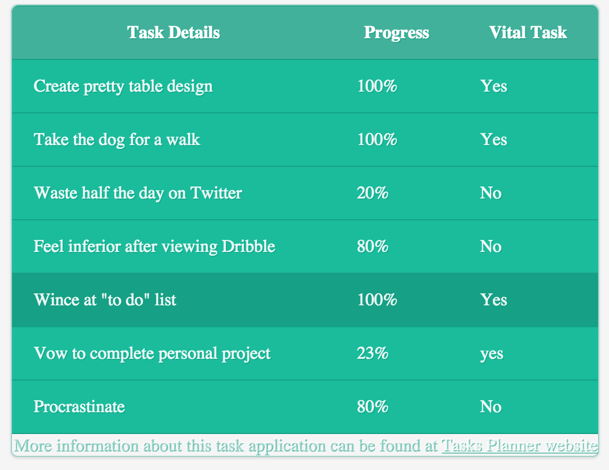
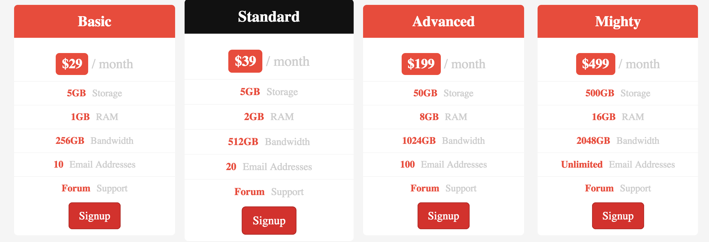
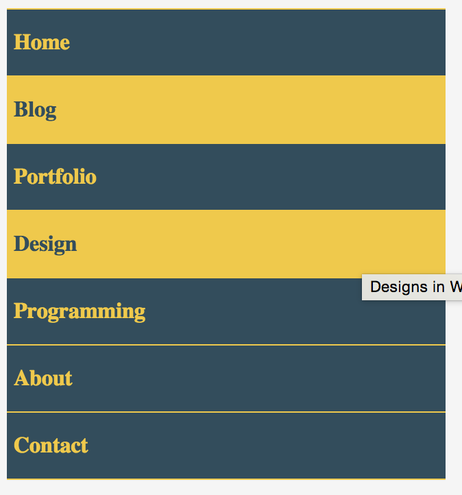
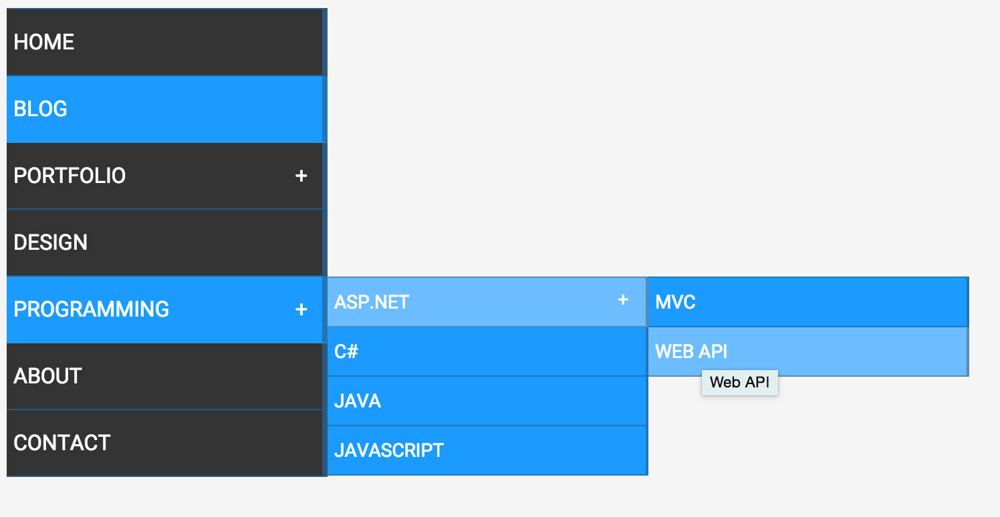
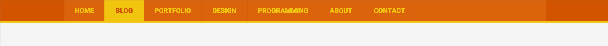
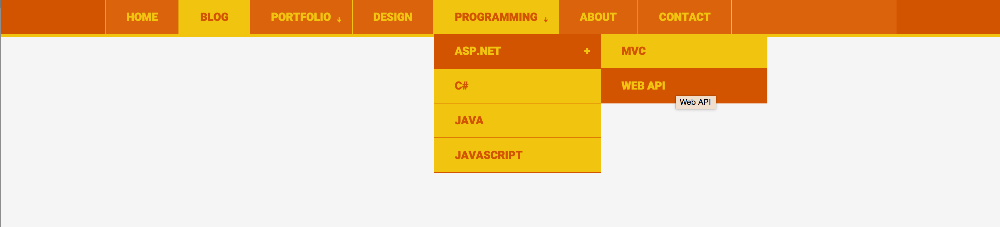
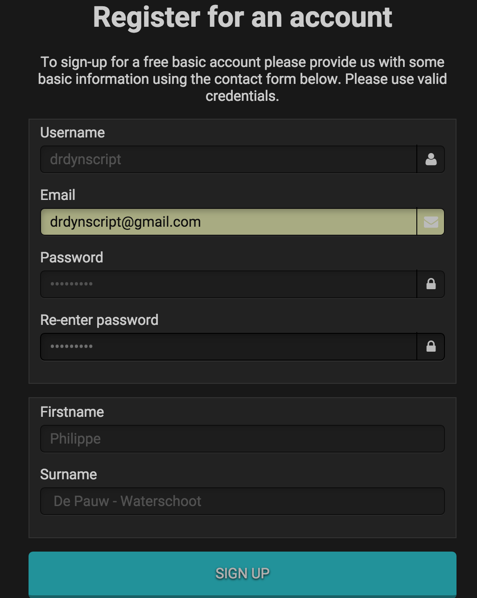
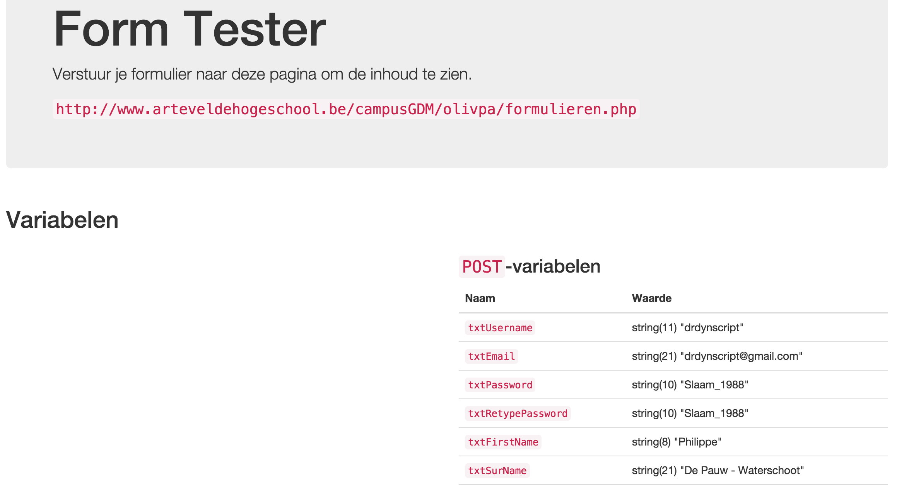

Oefeningen
====================

|Info|   |
|----|---|
|Olod|Webdesign II|
|Auteur(s)|Philippe De Pauw * Waterschoot, Olivier Parent, Bart Missant, Dieter De Weirdt|
|Opleiding|Bachelor in de Grafische en digitale media|
|Academiejaar|2015-16|

***

>
* Oefening 1: Simple Table
* Oefening 2: Table with ul > li > ...
* Oefening 3: Vertical Menu with depth 1
* Oefening 4: Vertical Menu with depth 1+
* Oefening 5: Horizontal Menu with depth 1
* Oefening 6: Horizontal Menu with depth 1+
* Oefening 7: Beautiful CSS Form

Oefening 1: Simple Table
------------------------

> Te gebruiken HTML­elementen:
> `<table> <thead> <tr> <th> <td> <tbody> <tfoot>`

**Inhoud**

```
Task DetailsProgressVital TaskCreate pretty table design100%YesTake the dog for a walk100%YesWaste half the day on Twitter20%NoFeel inferior after viewing Dribble80%NoWince at "to do" list100%YesVow to complete personal project23%yesProcrastinate80%NoMore information about this task application can be found at T​asks Planner website
```

**Eindresultaat**



Oefening 2: Table with ul > li > ...
------------------------

> Te gebruiken HTML­elementen:
> `<ul> <li> <a> <h3> <span>`

**Inhoud**

```
Basic
$29 / month 5GBStorage 1GBRAM 256GBBandwidth 10Email Addresses ForumSupport Signup
Standard
$39 / month 5GBStorage 2GBRAM 512GBBandwidth 20Email Addresses ForumSupport Signup
Advanced
$199 / month 50GBStorage 8GBRAM 1024GBBandwidth 100Email Addresses ForumSupport Signup
Mighty
$499 / month 500GBStorage 16GBRAM 2048GBBandwidth UnlimitedEmail Addresses ForumSupport
Signup
```

**Eindresultaat**



Oefening 3: Vertical Menu with depth 1
------------------------

> Te gebruiken HTML­elementen:
> `<ul> <li> <a>`

**Inhoud**

* Home
* Blog
* Portfolio
* Design
* Programming 
* About
* Contact

**Eindresultaat**



Oefening 4: Vertical Menu with depth 1+
------------------------

> Te gebruiken HTML­elementen:
> `<ul> <li> <a>`
>
> Geen JavaScript, geen images, enkel HTML en CSS

**Inhoud**

* Home
* Blog
* Portfolio
	* Webdesign
	* Webdevelopment 
	* App Development
* Design
* Programming
	* ASP.NET
		* MVC
		* WEB API 
	* C#
	* JAVA
	* JavaScript
* About
* Contact

**Eindresultaat**



Oefening 5: Horizontal Menu with depth 1
------------------------

> Te gebruiken HTML­elementen:
> `<ul> <li> <a>`
>
> Geen JavaScript, geen images, enkel HTML en CSS

**Inhoud**

* Home
* Blog
* Portfolio
* Design
* Programming
* About 
* Contact

**Eindresultaat**



Oefening 6: Horizontal Menu with depth 1+
------------------------

> Te gebruiken HTML­elementen:
> `<ul> <li> <a>`
>
> Geen JavaScript, geen images, enkel HTML en CSS

**Inhoud**

* Home
* Blog
* Portfolio
	* Webdesign
	* Webdevelopment 
	* App Development
* Design
* Programming
	* ASP.NET
		* MVC
		* WEB API 
	* C#
	* JAVA
	* JavaScript
* About
* Contact

**Eindresultaat**



Oefening 7: Beautiful CSS Form
------------------------

> Te gebruiken HTML­elementen:
> `<form> <fieldset> <legend> <div> <label> <input> <button> <span>`
>
> Te versturen naar
http://www.arteveldehogeschool.be/campusGDM/olivpa/formulieren.php

**Inhoud**

```
Register for an account
To sign­up for a free basic account please provide us with some basic information using the contact form below. Please use valid credentials.
Username
Email
Password Re­enter password Firstname Surname
SIGN UP
Eindresultaat
```

**Eindresultaat**




